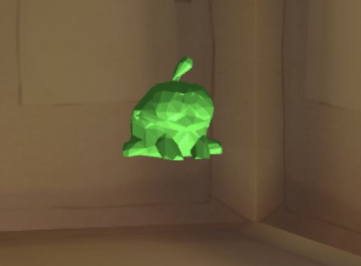
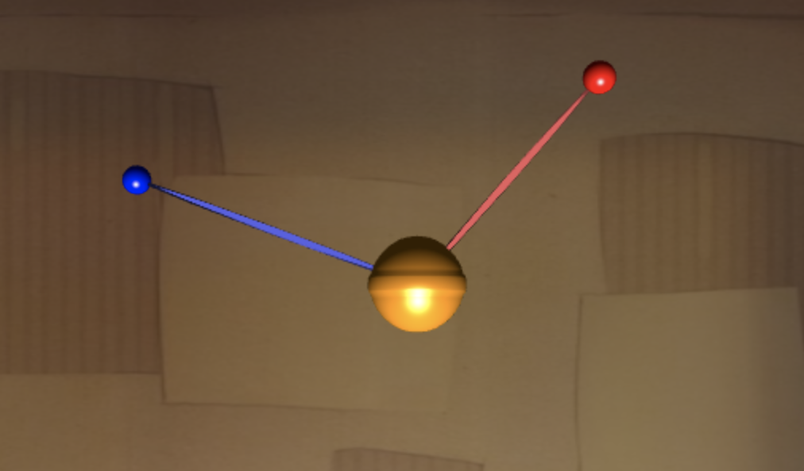

# Cut the Rope 3D

We designed a three-dimensional take on the original IOS game Cut the Rope.

Play it at: https://cuttherope3d.netlify.app/

### Table of contents

1. [Authors](#authors)
1. [How To Play](#how-to-play)
1. [Introduction](#introduction)
1. [Controls](#controls)
1. [Special Features](#special-features)
1. [Noteworthy Changes](#noteworthy-changes)
1. [References](#references)

### Authors <a name="authors"/>

---

##### Ian Conceicao

- Email: IanCon234@gmail.com
- Github: IanConceicao

##### Bryan Wong

- Email: brwong00@gmail.com
- Github: brwong00

##### Ruben Green

- Email: ragreen@g.ucla.edu
- Github: EvergreenGames

### How To Play <a name="how-to-play"/>

---

**Online:**

https://cuttherope3d.netlify.app/

**Locally:**

To play the game on your own device, simply run `python server.py` and open `localhost:8000` on a browser. Have fun!

### Introduction <a name="introduction"/>

---

We implemented a three-dimensional version of the classic mobile game Cut the Rope. Cut the Rope is a physics based puzzle game with the objective of feeding a piece of candy to a green creature called Om Nom. In the original game, players swipe their device to cut ropes that lets the candy fall, swing, or float in a bubble to Om Nom. Our implementation keeps many of the core features, but expanded the gameplay to three dimensions.

The center of our game is **Om Nom**, a loveable green creature that wants to eat as much **candy** as possible. Each level has one piece of candy, that initially starts attached to an **anchor** point by a **rope**. There are many components in the scene that can help or hinder the player from getting the candy to Om Nom. Firstly there are more anchors, other than the one the candy starts attached to. When the candy enters a radius near an anchor, a new rope attaches from the candy to that anchor. Anchors can be stationary, or they can follow spline defined paths. Next, there are **bubbles**, which are stationary until the candy enters. Once candy enters a bubble, the candy will float up in the air, until the player pops the surrounding buble, sending the candy falling down. In some levels the player will also find **fans**, which when triggered shoot out air that pushes candy away. Lastly, players will find blocks throughout levels, that serve as obstacles or helpers for the candy to bounce out of. Each level takes place in a shoe-box style world lined with colorful wallpapers, in spirit with the original game.

Images of components of our scene are posted below:

**Om Nom:**

 

**Candy and Still Ropes:**

 

**Moving Anchor and Rope:**

 

**Bubbles:**

 

**Fans:**

### Controls <a name="controls"/>

---

**Game Controls:**

The game is now controlled by simply clicking on the objects to activate them! The following objects can be activated with just a click.

- **Anchors**: If the candy is attached by a rope to an anchor point, clicking on the anchor point will cut the rope, unattaching the candy. Note the anchor point must be clicked, not the rope.
- **Fans**: Clicking fans will cause the fan to release a puff of air, blowing the candy away.
- **Bubbles**: If the candy has been trapped in a bubble, the bubble can be popped in order to free the candy. The bubble cannot be popped if the candy is not inside of it.

 

**Camera Controls:**

The camera is controlled using the i, j, k, l keys.

- **i**: Pan camera up
- **k**: Pan camera down
- **j**: Rotate camera left
- **l**: Rotate camera right

 

**Debug Controls:**

The following debugging controls may also be useful.

- **` + r**: Restart level
- **` + t**: Skip level

### Special Features <a name="special-features"/>

---

We implemented **Symplectic Euler** integration to calculate our general physics. We treated our candy object as a particle. The particle has a has mass and external forces can be applied from ropes, bubbles, blocks, and fans.

To calculate the physics of ropes, we used the **mass-spring-damper** system. Each rope is a one long spring system with a fixed anchor point on one side, and the candy on the other. We found this simulates the physics of a stretchy rope quite well.

We used **collision detection** and resolution to detect whether Om Nom has eaten the candy, the candy has fallen out of bounds, or the candy collided with other interactable objects such as ropes or solid blocks. We also used collision detection in **ray casting**. To interact with any object, the player only needs to click on it. This shoots out a ray from the camera to the point the player has clicked. The ray is discretized into points, and the points are checked whether they are in objects or not.

Moveable anchors travel along pre-planned trajectories. To calculate these trajectories we used **Hermite Splines** along with control points to create smooth paths.

### Noteworthy Changes <a name="noteworthy-changes"/>

---

Since the original project demo, there have been a few significant improvements made to the game.

1. **Raycasting Click Controls:** Raycasting has been implemented to allow the game to be easily controlled just be clicking on the various objects.
1. **Beautiful New Boxes:** Just like in the original game, each level now takes place in a magic box made of cardboard, fabric, or foil. New camera controls allow the user to easily look around the level while staying within the magic box.
1. **Three Complete Levels:** The game now features three fully fleshed out levels using a mix of the various components and obstacles available in the game. Finishing all three levels leads to a cute victory screen.

### References <a name="references"/>

---

#### Original Cut the Rope Game

[Google Play Store](https://play.google.com/store/apps/details?id=com.zeptolab.ctr.ads&hl=en_US&gl=US)

#### Ray Casting

[Tutorial we Followed](https://antongerdelan.net/opengl/raycasting.html)

#### Fan

Generating air balls to emit randomly from a fan proved to be tough. It essientially boiled down to generating random vectors in a cone. I referenced this [stack exchange](https://gamedev.stackexchange.com/questions/26789/random-vector-within-a-cone?noredirect=1&lq=1).

#### Obj Files Used:

[Om Nom](https://sketchfab.com/3d-models/cut-the-rope-om-nom-efbad9c37e474c5a9624d86adf442191) (modified)

[Candy](https://www.cgtrader.com/free-3d-models/food/miscellaneous/lollipop-e7c0890a-8833-4f79-a35b-5084be12d53c) (modified)

#### Textures Used:

[Walls](https://www.vg-resource.com/thread-21555.html)
